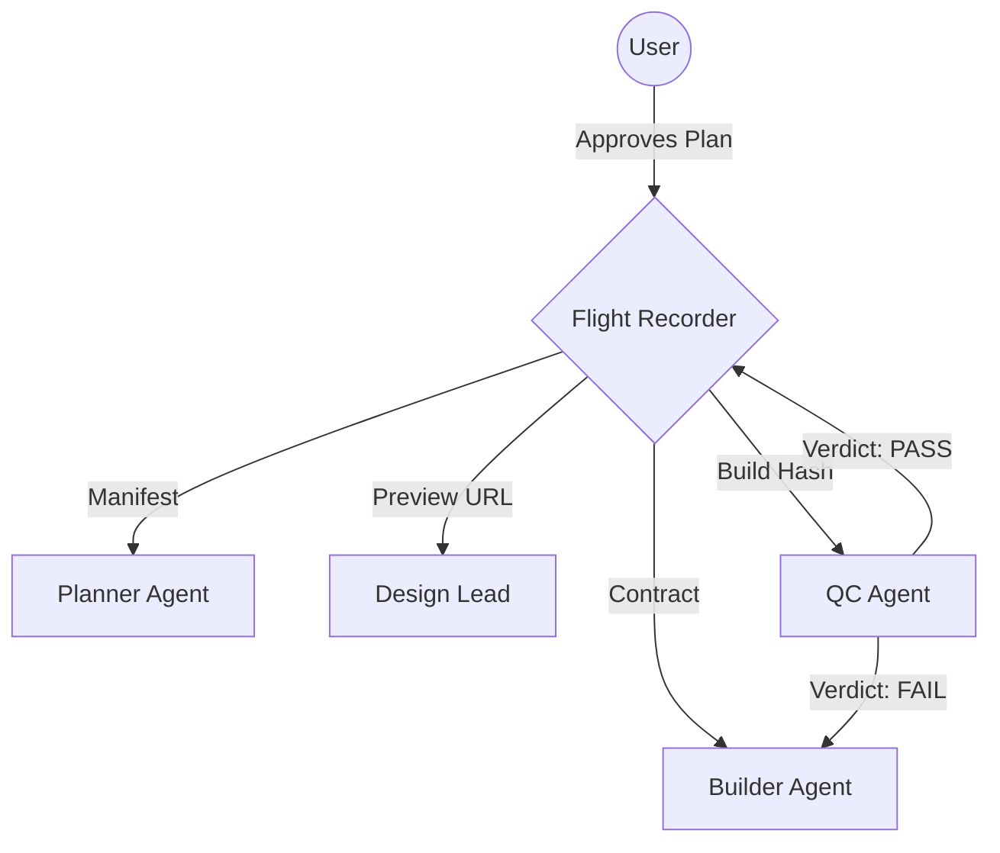

# Antigravity OS (V2.1 Enterprise)

> **"High-Gravity Governance for a Weightless Developer Experience."**

**Antigravity OS** is a governance kernel that transforms your IDE (Cursor, VS Code) from a simple code editor into a **deterministic software factory**. It forces AI Agents to adhere to strict SDLC protocols, ensuring that generated code is planned, secure, and tested before it ever reaches production.

---

## The Problem: Ungoverned AI
Most AI coding assistants operate as "Cowboy Coders." They hallucinate APIs, skip security checks, create circular dependency loops, and generate "working" code that is unmaintainable.

## The Solution: Fail-Closed Architecture
Antigravity OS installs a **Constitution** into your project. It replaces the "Chatbot" persona with an **Orchestrator** that follows a strict **Hub-and-Spoke Architecture**.

* **No Planning?** The Builder Agent is blocked from writing code.
* **No Contract?** The Frontend Agent cannot invent API endpoints.
* **No Validation?** The QC Agent prevents the code from being merged.

---

## Core Features

### 1. The Flight Recorder Protocol (State Machine)
We do not pass raw text between agents. We pass a **Flight Recorder Object**—a deterministic JSON state ledger that tracks:
* `trace_id`: The unique signature of the feature.
* `status`: Rigid states (`PLANNING` → `BUILDING` → `READY_FOR_MERGE`).
* `handover_manifest`: Cryptographic proof that the previous step was completed (e.g., a Build Digest or Test Report).

### 2. The Workforce (Role-Based Access Control)
Your AI is partitioned into 5 distinct personas with separate permissions:
1.  **The Architect (Planner)**: Reads docs, generates Markdown Plans. *Cannot write code.*
2.  **The Builder (Full-Stack)**: Implements code based *strictly* on the Plan and API Contract.
3.  **The Design Lead (Frontend)**: Connects UI components to the API. *Must verify against the Contract.*
4.  **The Nerd (QC)**: Adversarial tester. Tries to break the build. *Fail-Closed Gatekeeper.*
5.  **The Sentinel (SecOps)**: Enforces dependency governance (Protocol C) and scans for secrets.

### 3. The Constitution (Immutable Rules)
The system injects a `.agent/rules/` directory containing the Laws of Physics for your project:
* **Rule 00 (Plan First):** Code cannot exist without a signed Plan Artifact.
* **Rule 01 (Data Contracts):** The `API_Contract.md` is the Single Source of Truth.
* **Rule 06 (Strict Handover):** Agents must exchange a valid Manifest to pass the baton.

---

## Installation

Turn any repository into an Antigravity Project with one command:

```bash
/bin/bash -c "$(curl -fsSL https://raw.githubusercontent.com/manzela/Antigravity-OS/main/install.sh)"
```

### What this does:
1.  **Scaffolds the Brain:** Creates `.agent/`, `artifacts/`, and `docs/` directories.
2.  **Ratifies the Constitution:** Downloads the V2.1 Rule Set (00-06).
3.  **Installs the Schema:** Deploys the `Flight_Recorder_Schema.json` state engine.
4.  **Injects the Bridge:** Configures `.cursorrules` to force the AI to respect the new laws.

---

## Usage Workflow

Once installed, your interaction model shifts from "Chatting" to "Commanding":

**1. Initialize**
> "Status Check."
> *(System responds with Flight Recorder JSON: `status: PLANNING`)*

**2. Plan**
> "/plan-feature 'Add Dark Mode toggle to the settings page.'"
> *(Architect Agent generates `artifacts/plans/feat-dark-mode.md`)*

**3. Approve**
> "Plan looks good. Proceed."
> *(System transitions to Builder Agent. `status: BUILDING`)*

**4. Build & Verify**
> *(Builder writes code. QC Agent runs tests. Sentinel checks dependencies.)*

**5. Merge**
> *(System presents `artifacts/validation-reports/report.md` for final human sign-off.)*

---

## System Architecture



---

*Powered by the Antigravity SDLC V2.1 Standard.*
